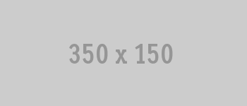

## Mytest Sponsors

The Mytest gem needs your help!  There's been an average of 6 open issues since its launch and very little code has been written.  We need help raising zero dollars to support the 10s of downloads mytest gets from [rubygems.org](http://rubygems.org/gems/mytest).

Thank you to all the sponsors of @tenderlove's [mytest](https://github.com/tenderlove/mytest) gem!

### Be A Sponsor!

> Sponsor for life is zero dollars.

Sponsorship of [mytest](https://github.com/tenderlove/mytest) is free.  Please contact [@squarism](https://twitter.com/squarism) to become a sponsor.